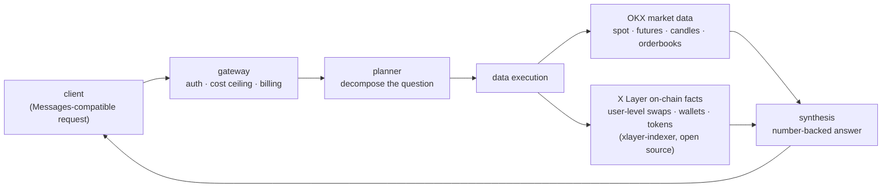

# okx-research — AI research pipeline for the OKX ecosystem

An agentic research API over everything OKX: exchange markets (spot & futures,
prices, candles, tickers, orderbooks) and **X Layer on-chain activity** — powered
by our own user-level index of the chain
([xlayer-indexer](https://github.com/monolit-network/xlayer-indexer), open source).

Ask a question in natural language — get a synthesized, number-backed answer.
The scope is deliberately locked to OKX: other exchanges/chains are not served.

Built for [OKX Dev Day 2026](https://luma.com/l4aq8vii) (OKX AI track).

## Why agents need this

LLM agents are extremely intolerant of dirty data: they take whatever a query
returns as ground truth and confidently build on it. This pipeline answers from
**facts, not raw logs** — user-level swaps with real-actor attribution, verified
market data — so the agent's confidence is earned. See
[why data quality is existential for AI agents](https://github.com/monolit-network/xlayer-indexer#why-data-quality-is-existential-for-ai-agents).

## API

- **Endpoint:** `https://mcp.monolit.network/okx`
- **Auth:** your Monolit key in the `x-api-key` header
- **Wire format:** Anthropic Messages API-compatible — any integration written
  against the Anthropic API ports over with a base-URL change.

### Ask

```bash
curl https://mcp.monolit.network/okx/v1/messages \
  -H "x-api-key: YOUR_KEY" -H "content-type: application/json" \
  -d '{"model":"okx-research","max_cost_usd":0.5,
       "messages":[{"role":"user","content":"Candles and current price for \"OKB-USDT\" on OKX — what is going on?"}]}'
```

One public model (`model` field): **`okx-research`** — a research pipeline
(planner → data execution → synthesis). The same mode runs synchronously,
streaming, or in the background; depth and price are governed by your
`max_cost_usd` ceiling.

| Mode | How | Time | Suggested `max_cost_usd` |
|---|---|---|---|
| synchronous | plain POST | 10–100 s | 0.15–0.5 |
| background (deep) | `"background": true` | 3–20 min | 0.5–1.0 (hard cap $10) |
| streaming | `"stream": true` (SSE) | as generated | — |

### Long jobs → background

Launch with `"background": true` — you get `{"id":"job_..."}` instantly. Poll:

```bash
curl https://mcp.monolit.network/okx/v1/jobs/job_XXX -H "x-api-key: YOUR_KEY"
```

Poll every 10–30 s until `status == "completed"`. Results are kept for 24 h and
are visible only to your key.

### Response fields

- `content[0].text` — the answer;
- `usage.cost_usd` — LLM processing cost; `usage.llm_credits` /
  `tool_credits` / `charged_credits` — the breakdown;
- `_billing.credits_charged` / `credits_remaining` — charged / balance;
- `stop_reason: "max_cost"` — your `max_cost_usd` ceiling was hit; the answer
  is synthesized from what was already gathered.

### Rules & tips

- `max_cost_usd` is a per-request spending ceiling (default $0.5, hard cap $10).
  The ceiling is reserved up front: a failed request is fully refunded; a
  partial answer on `max_cost` is billed by actual usage, never above the ceiling.
- Name the pair/token exactly, in quotes — faster and more precise.
- A synchronous request lives at most ~100 s (network limit) — run heavy
  questions in the background.
- Balance & history: `GET /v1/usage?days=30`; model list: `GET /v1/models`.

## Drop-in with the Anthropic SDK

The wire format is Messages-compatible, so official SDKs work as clients:

```python
from anthropic import Anthropic

client = Anthropic(base_url="https://mcp.monolit.network/okx", api_key="YOUR_KEY")
msg = client.messages.create(
    model="okx-research",
    max_tokens=4096,
    extra_body={"max_cost_usd": 0.5},
    messages=[{"role": "user", "content": 'Top traded tokens on X Layer this week — anything unusual?'}],
)
print(msg.content[0].text)
```

More runnable examples in [`examples/`](examples/); **nine real sessions with
unedited answers — [SHOWCASE.md](SHOWCASE.md)** (deep research and fast tables,
incl. the built-in figure check that flags any number not present in tool outputs).

## Architecture



The on-chain leg is the differentiator: questions about wallets, tokens and
smart money on X Layer are answered from a user-level index (24.4M swaps, full
OP-era history, 0-block lag, real-actor attribution behind routers/AA/custodial
contracts) — not from raw logs.

## License

Docs and examples: Apache-2.0. The hosted pipeline is a managed service.
